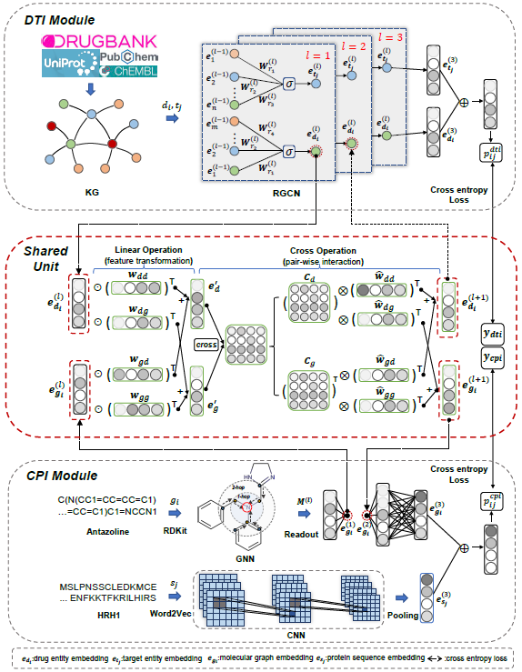

<!--
 * @Author: your name
 * @Date: 2021-05-12 05:23:23
 * @LastEditTime: 2021-05-25 02:23:41
 * @LastEditors: Please set LastEditors
 * @Description: In User Settings Edit
 * @FilePath: /kg-mtl/README.md
-->
# KG-MTL: Knowledge Graph Enhanced Multi-Task Learning for Molecular Interaction
This is our implementation of the paper

> Tengfei Ma, Xuan Lin, Bosheng Song, Philip S. Yu and Xiangxiang Zeng. KG-MTL: Knowledge Graph Enhanced Multi-Task Learning for Molecular Interaction. TKDE' 2022 accepted

<div align=center></div>
Figure 1 shows the overview of KG-MTL. KG-MTL extracts the features from both knowledge graph and molecular graph in a synergistical way. Moreover, we design an effective Shared Unit that helps the model to jointly preserve the semantic relations of drug entity and the neighbor structures of compound in both levels of graphs. Extensive experiments on four real-world datasets demonstrate that our proposed KG-MTL outperforms the state-of-the-art methods on two representative molecular interaction prediction tasks: drug-target interaction (DTI) prediction and compound-proteininteraction (CPI) prediction.

# Requirement
* pytorch==1.5.0
* dglteam==dgl-cuda10.1
* rdkit==2018.09.3
* dgllife
# Installation
You can create a virtual environment using [conda](https://github.com/conda/conda).
```bash
conda create -n kg-mtl python=3.7 
source activate kg-mtl  
git clone https://github.com/xzenglab/KG-MTL.git  
cd KG-MTL
conda install pytorch==1.5.0 torchvision==0.6.0 cudatoolkit=10.1 -c pytorch
conda install -c dglteam dgl-cuda10.1
conda install -c rdkit rdkit==2018.09.3
pip install dgllife
```

# Datasets
We provide the files of knowledge graph DRKG, and the datasets used in DTI and CPI tasks. 
+ DRKG https://github.com/gnn4dr/DRKG
+ BindingDB https://www.bindingdb.org/bind/index.jsp
+ Human http://admis.fudan.edu.cn/negative-cpi/
+ C.elegans http://admis.fudan.edu.cn/negative-cpi/
+ DrugBank https://go.drugbank.com/releases/latest
+ DrugCentral https://drugcentral.org/

However, we found that the original links of the Human and C.elegans datasets were unavailable, so we put the source files in the path `datasets/original_cpi`. In the repository `https://github.com/xiaomingaaa/drugbank`, we provide code and processed files that can be used for entity id conversion among databases.

# Usage
```bash
usage: main.py [-h] [--dropout DROPOUT] [--n-hidden N_HIDDEN] [--gpu GPU]
               [--lr_pre LR_PRE] [--lr_dti LR_DTI] [--n_bases N_BASES]
               [--sample_size SAMPLE_SIZE] [--n-layers N_LAYERS]
               [--n-epochs N_EPOCHS] [--regularization REGULARIZATION]
               [--grad-norm GRAD_NORM] [--graph-split-size GRAPH_SPLIT_SIZE]
               [--negative-sample NEGATIVE_SAMPLE]
               [--edge-sampler EDGE_SAMPLER]
               [--graph_batch_size GRAPH_BATCH_SIZE]
               [--rgcn_epochs RGCN_EPOCHS] [--loss_lamda LOSS_LAMDA]
               [--cpi_dataset CPI_DATASET] [--dti_dataset DTI_DATASET]
               [--shared_unit_num SHARED_UNIT_NUM] [--embedd_dim EMBEDD_DIM]
               [--variant VARIANT] [--loss_mode LOSS_MODE]
```
`--loss_mode weighted` is the learning stratagies, and 'weighted' represents the certainty is used.

```bash
python main.py --loss_mode weighted --variant KG-MTL-C --gpu 1 --cpi_dataset human --dti_dataset drugcentral
```
You can change the parameter '--variant' to run different variants (i.e., KG-MTL-C, KG-MTL-L, and KG-MTL-S) of KG-MTL. And you can adjust the multi-task learning strategy by modifying the parameter '--loss_mode'.

# Citation
```bash
@ARTICLE{kg_mtl_22,
  author={Ma, Tengfei and Lin, Xuan and Song, Bosheng and Yu, Philip S. and Zeng, Xiangxiang},
  journal={IEEE Transactions on Knowledge and Data Engineering}, 
  title={KG-MTL: Knowledge Graph Enhanced Multi-Task Learning for Molecular Interaction}, 
  year={2022},
  volume={},
  number={},
  pages={1-12},
  doi={10.1109/TKDE.2022.3188154}}
```

For any clarification, comments, or suggestions please create an issue or contact [Tengfei Ma](tfma@hnu.edu.cn).


